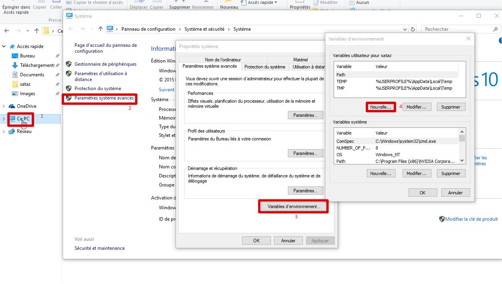
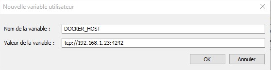

# Installation

Docker n'est pour l'instant compatible qu'avec GNU/Linux (Et BSD en compatibilité Linux). Windows travail par contre sur le projet, et une version custom de docker verra le jour pour la prochaine *Release Candidate* de Windows Server 2016.
Cela ne veut pas dire qu'il n'y à aucun moyen de l'utiliser sur Windows ou Mac.

## Installation sous Linux

Il existe des paquets tout prêt pour la plupart des distributions. Je vous renvoie vers ces paquets avec les procédures d'installation :
[https://docs.docker.com/installation/](https://docs.docker.com/installation/)

Nous allons partir sur une debian Jessie (Parce que !!!) :
On commence par installer les pré-requis puis on en profite pour faire une mise à jour :
```shell
$ apt-get update && apt-get upgrade && apt-get install apt-transport-https ca-certificates xz-utils iptables aufs-tools git
```

Puis on ajoute le dépôt, ainsi que la clée GPG de celui ci :
```shell
$ echo "deb https://apt.dockerproject.org/repo debian-jessie main" > /etc/apt/sources.list.d/docker.list
$ apt-key adv --keyserver hkp://p80.pool.sks-keyservers.net:80 --recv-keys 58118E89F3A912897C070ADBF76221572C52609D
```

Puis on installe :
```shell
$ apt-get update && apt-get install docker-engine
```

Il existe plusieurs versions de docker dans ce dépôt, vous pouvez choisir celle-ci :
```shell
$ apt-cache policy docker-engine
$ apt-get install docker-engine=1.10.1
```

Vous pouvez également ajouter les dépôts testing (release candidate) ou experimental (build git) :
```shell
$ echo "deb https://apt.dockerproject.org/repo debian-jessie testing" > /etc/apt/sources.list.d/docker.list
```

Il ne nous reste plus qu'à lancer docker :
```shell
$ systemctl start docker
$ systemctl enable docker
```

Pour que docker fonctionne dans les meilleurs conditions, il faut ajouter ceci sous Debian dans le /etc/default/grub :
```shell
GRUB_CMDLINE_LINUX="cgroup_enable=memory swapaccount=1"
```
Ceci permets de limiter la ram utilisable par un conteneur.

Puis on regénère notre grub :
```shell
grub-mkconfig -o /boot/grub/grub.cfg
Création du fichier de configuration GRUB…
Image Linux trouvée : /boot/vmlinuz-3.16.0-4-amd64
Image mémoire initiale trouvée : /boot/initrd.img-3.16.0-4-amd64
fait
```

On reboot, et c'est good.

On va tester avec une image de test :
```shell
$ docker run hello-world
Unable to find image 'hello-world:latest' locally
latest: Pulling from library/hello-world

03f4658f8b78: Pull complete
a3ed95caeb02: Pull complete
Digest: sha256:8be990ef2aeb16dbcb9271ddfe2610fa6658d13f6dfb8bc72074cc1ca36966a7
Status: Downloaded newer image for hello-world:latest

Hello from Docker.
This message shows that your installation appears to be working correctly.

To generate this message, Docker took the following steps:
 1. The Docker client contacted the Docker daemon.
 2. The Docker daemon pulled the "hello-world" image from the Docker Hub.
 3. The Docker daemon created a new container from that image which runs the
    executable that produces the output you are currently reading.
 4. The Docker daemon streamed that output to the Docker client, which sent it
    to your terminal.

To try something more ambitious, you can run an Ubuntu container with:
 $ docker run -it ubuntu bash

Share images, automate workflows, and more with a free Docker Hub account:
 https://hub.docker.com

For more examples and ideas, visit:
 https://docs.docker.com/userguide/
```

## Installation sous Windows
Sous windows il existe 3 manières de l'installer :
* A la main => Une VM docker, avec le client docker sur windows
* Docker-toolbox => Exécutable qui installe tout, virtualbox, une VM, et les clients
* Docker4Windows => Comme docker-toolbox, mais en mieux, utilise hyper-v au lieu de virtualbox (encore en version beta, seulement compatible à partir de windows 10 Pro)

### Docker4Windows
Docker4Windows est encore en version bêta, mais reste totalement utilisable au quotidien.
Pour le moment il n'est compatible qu'avec windows 10 (version pro, enterprise et education), donc si vous êtes sur une autre version de windows, il faudra passer par docker-tools ou faire une installation manuelle.

Avant de commencer l'installation de docker4windows, nous devons activer hyper-v.
Pour ce faire, clique droit sur le menu d'application -> panneau de configuration -> Programmes et fonctionnalités -> Activer ou désactiver des fonctionnalités Windows -> Cocher Hyper-V -> OK.

On redémarre le PC, et normalement c'est bon, nous avons Hyper-V.

On peut passer à l'installation de docker4windows, et là c'est vraiment simple, télécharger l'exécutable [ici](https://download.docker.com/win/beta/InstallDocker.msi), ensuite c'est du next-next.


### Docker-toolbox
L'installation de docker-toolbox est rapide, il suffit de télécharger [docker-toolbox](https://github.com/docker/toolbox/releases), ensuite c'est du next-next.
Ceci vous installera toute la panoplie du super-docker, c'est à dire, virtualbox avec une VM boot2docker, les clients docker, docker-machine et docker-compose pour windows. Puis également, si vous le souhaitez, kitematic, qui est un GUI pour installer des applications via docker.


### Installation manuelle
Puisqu'on est là pour apprendre, je vais vous montrer une méthode manuel.
Je vais donc vous expliquer comment faire pour l'installer sur windows, et vous allez voir, c'est pas compliqué.
Nous allons donc faire la même installation que docker-toolbox.

Premièrement, il faut une machine virtuelle, utilisez la partie précédente pour vous en créer une.
Personnellement j'utilise hyper-v, mais vous pouvez utiliser virtualbox ou vmware.

Une fois votre machine virtuelle configuré, nous avons quelques spécificités à configurer :
Nous allons commencer par configurer correctement le daemon de notre machine docker serveur :
[code]vim /etc/default/docker[/code]
puis on écrit ceci :
```shell
# /etc/default/docker
DOCKER_OPTS="-H tcp://0.0.0.0:4242 -H unix:///var/run/docker.sock"
```

En gros on dit à docker d'écouter également le port 4242 pour une utilisation à distance, en plus du socket pour une utilisation en local (via ssh par exemple).
On relance bien sur le daemon :
```shell
systemctl restart docker.service
```

Maintenant on passe à l'installation du client docker :
On télécharge d'abord l'exécutable sur ce [lien]https://get.docker.com/builds/Windows/x86_64/docker-latest.zip)
On crée un répertoire dans le C: qui s'appellera docker puis un autre dossier dedans qui s'appellera bin, puis on copie le .exe dans c:\docker\bin.

On peut désormais tester, on ouvre une console (touche windows+R puis cmd), il faut se positionner dans le C:\docker\bin, puis on test la connexion (penser à changer l'IP par celle de votre serveur docker) :

```shell
C:\docker>docker.exe -H tcp://192.168.1.16:4242 version
Client:
 Version:      1.12.0
 API version:  1.24
 Go version:   go1.6.3
 Git commit:   8eab29e
 Built:        Thu Jul 28 21:04:48 2016
 OS/Arch:      windows/amd64
 Experimental: true

Server:
 Version:      1.12.0
 API version:  1.24
 Go version:   go1.6.3
 Git commit:   8eab29e
 Built:        Thu Jul 28 21:15:28 2016
 OS/Arch:      linux/amd64
```

Le -H permet de dire sur quelle machine on se connecte.

Pour le moment c'est un peu contraignant de devoir ce mettre dans le C:\docker et devoir faire un -H tcp://192.168.1.16:4242 à chaque fois, mais on va régler ceci. Pour cela il va falloir jouer avec les variables d'environnements.
Pour ce faire :
Clique droit sur "Ordinateur" (ou "Ce PC") => Propriétés => Paramètres système avancés => Variables d'environnement


Et on ajoute une variable utilisateur comme ceci :  


On modifie également la variables système Path et on ajoute à la fin :
`;c:\docker\bin`
il faut faire attention, il ne faut rien supprimer, mais ajouter à la fin, sans oublier le ; pour séparer la nouvelle variable.


Maintenant on peut refaire un essai sans ce positionner dans le bon dossier :
```shell
D:\Users\xataz>docker version
Client:
 Version:      1.12.0
 API version:  1.24
 Go version:   go1.6.3
 Git commit:   8eab29e
 Built:        Thu Jul 28 21:04:48 2016
 OS/Arch:      windows/amd64
 Experimental: true

Server:
 Version:      1.12.0
 API version:  1.24
 Go version:   go1.6.3
 Git commit:   8eab29e
 Built:        Thu Jul 28 21:15:28 2016
 OS/Arch:      linux/amd64
```

\o/ ça marche !!!

Nous allons rajouter une petite chose pour que l'environnement soit parfait, nous allons créer un partage entre notre VM et notre windows.

__Partie sous windows :__  
Pour se faire, créez un dossier Docker dans un endroit stratégique, personnellement j'ai choisi D:\Docker.
Puis clique droit sur ce dossier -> propriétés -> onglet "Partage" -> cliquez sur "Partager..." -> Puis cliquez sur "Partager".

Il vous faudra par contre absolument un mot de passe à votre compte windows.


__Partie sous la VM :__  
On crée également un répertoire stratégique, personnellement j'ai créé un répertoire Docker à la racine :
```shell
$ mkdir /Docker
```
Il faut simplement éditer le fstab en ajoutant ceci :
```shell
//192.168.1.11/Docker /Docker cifs defaults,uid=xataz,gid=docker,file_mode=0777,dir_mode=0777,username=userwindows,password=mdpwindows 0 0
```
N'oubliez pas de remplacer l'uid par votre user linux, et username,password par ceux de windows. 192.168.1.11 étant l'ip de mon windows.

Et on monte le partage :
```shell
$ root@boot2docker:~# mount -a
```

Malgré qu'il soit possible de tout faire via le docker installé sur windows, je conseille de l'utiliser via une console ssh, pour la simple et bonne raison que l'affichage est adapté au terminal Linux.

## Install sous Mac

Il y a deux solution pour installer docker sur mac osx
* Docker4Mac
* Docker-toolbox

### Docker4Mac

Docker4Mac est encore en version bêta, mais reste totalement utilisable au quotidien.

L'installation de docker4Mac est vraiment simple, téléchargez l'exécutable [ici](https://download.docker.com/mac/beta/Docker.dmg) et ensuite c'est du next-next.

### Docker-toolbox
Il faut télécharger l'installateur "docker toolbox" ici :
[https://www.docker.com/products/docker-toolbox](https://www.docker.com/products/docker-toolbox)

Ensuite vous exécutez le pkg et installez docker comme indiqué ici :
[https://docs.docker.com/engine/installation/mac/](https://docs.docker.com/engine/installation/mac/)

Ensuite il faut créer une VM docker, ça va créer une vm dans virtualbox qui aura pour nom docker (vous pourrez vérifier dans virtualbox)
```shell
docker-machine create --driver virtualbox docker
```

Pour connecter notre shell à chaque fois avec la vm docker
```shell
echo 'eval "$(docker-machine env docker)"' >> ~/.bash_profile
```
__Nous avons ici utiliser docker-machine pour créer notre machine, nous verrons dans un autre chapitre comment l'utiliser.__


Et pour finir on test si ça fonctionne :
```shell
$ docker run hello-world
Unable to find image 'hello-world:latest' locally
latest: Pulling from library/hello-world

03f4658f8b78: Pull complete
a3ed95caeb02: Pull complete
Digest: sha256:8be990ef2aeb16dbcb9271ddfe2610fa6658d13f6dfb8bc72074cc1ca36966a7
Status: Downloaded newer image for hello-world:latest

Hello from Docker.
This message shows that your installation appears to be working correctly.

To generate this message, Docker took the following steps:
 1. The Docker client contacted the Docker daemon.
 2. The Docker daemon pulled the "hello-world" image from the Docker Hub.
 3. The Docker daemon created a new container from that image which runs the
    executable that produces the output you are currently reading.
 4. The Docker daemon streamed that output to the Docker client, which sent it
    to your terminal.

To try something more ambitious, you can run an Ubuntu container with:
 $ docker run -it ubuntu bash

Share images, automate workflows, and more with a free Docker Hub account:
 https://hub.docker.com

For more examples and ideas, visit:
 https://docs.docker.com/userguide/
```

## Mon environnement de test
Je suis sous windows 10, avec docker4windows, donc ma VM sous hyper-v. Je l'utilise le plus souvent sous powershell, mais il m'arrive de l'utiliser sous bash.

Version de docker :
```shell
PS C:\> docker version
Client:
 Version:      1.12.0
 API version:  1.24
 Go version:   go1.6.3
 Git commit:   8eab29e
 Built:        Thu Jul 28 21:04:48 2016
 OS/Arch:      windows/amd64
 Experimental: true

Server:
 Version:      1.12.0
 API version:  1.24
 Go version:   go1.6.3
 Git commit:   8eab29e
 Built:        Thu Jul 28 21:15:28 2016
 OS/Arch:      linux/amd64
```
